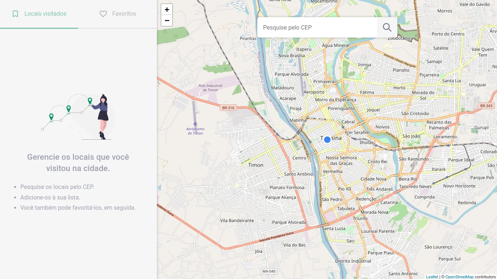

# Desafio Front-end

Resposta ao desafio técnico para vaga de Front-End Jr.

Consiste em um web app para gerenciar os locais visitados na cidade.

Acessar a demonstração: https://places-visited.vercel.app

<p align="center">
  
</p>

## ⚙️ Tecnologias utilizadas

- [TypeScript](https://www.typescriptlang.org/)
- [ReactJS](https://reactjs.org/)
- [Leaflet](https://react-leaflet.js.org/)

## 🚀 Como executar

Clone o projeto e acesse a pasta do mesmo:

```bash
$ git clone https://github.com/wellysonvie/desafio-frontend.git
$ cd desafio-frontend
```

Para iniciá-lo, siga os passos abaixo:

```bash
# Instalar as dependências
$ yarn

# Iniciar o projeto
$ yarn start
```

Agora você pode acessar [`http://localhost:3000`](http://localhost:3000) no navegador.

Executando os testes de integração:

```bash
# Executar testes com browser ocultado
$ yarn cy:run

# Executando com Cypress Test Runner
$ yarn cy:open
```

---

👨‍💻 Desenvolvido por [Wellyson Vieira]('https://github.com/wellysonvie/')
